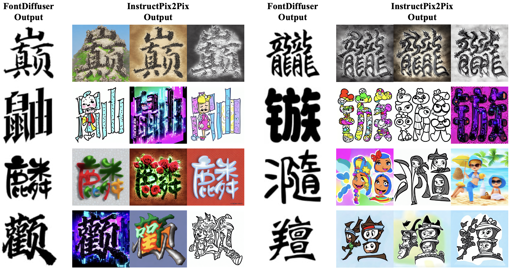
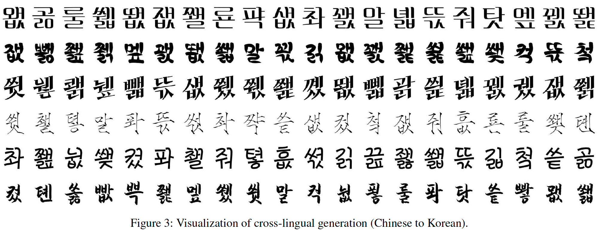

<div align=center>

# FontDiffuser: One-Shot Font Generation via Denoising Diffusion with Multi-Scale Content Aggregation and Style Contrastive Learning

</div>

  

<div align=center>

[](https://arxiv.org/abs/2312.12142) 
[](https://huggingface.co/spaces/yeungchenwa/FontDiffuser-Gradio)
[](https://yeungchenwa.github.io/fontdiffuser-homepage/)
[](https://github.com/yeungchenwa/FontDiffuser)

</div>


<p align="center">
   <strong><a href="#🔥-model-zoo">🔥 Model Zoo </a></strong> •
   <strong><a href="#🛠️-installation">🛠️ Installation </a></strong> •
   <strong><a href="#🏋️-training">🏋️ Training</a></strong> •
   <strong><a href="#📺-sampling">📺 Sampling</a></strong> •
   <strong><a href="#📱-run-webui">📱 Run WebUI</a></strong>   
</p>

## 🌟 Highlights


+ We propose **FontDiffuser**, which can generate unseen characters and styles and can be extended to cross-lingual generation, such as Chinese to Korean.
+ **FontDiffuser** excels in generating complex characters and handling large style variations. And it achieves state-of-the-art performance. 
+ The generated results by **FontDiffuser** can be perfectly used for **InstructPix2Pix** for decoration, as shown in thr above figure.
+ We release the 💻[Hugging Face Demo](https://huggingface.co/spaces/yeungchenwa/FontDiffuser-Gradio) online! Welcome to Try it Out!  

## 📅 News
- **2024.01.27**: The training of phase 2 is released.
- **2023.12.20**: Our repository is public! 👏🤗
- **2023.12.19**: 🔥🎉 The 💻[Hugging Face Demo](https://huggingface.co/spaces/yeungchenwa/FontDiffuser-Gradio) is public! Welcome to try it out!
- **2023.12.16**: The gradio app demo is released.   
- **2023.12.10**: Release source code with phase 1 training and sampling.   
- **2023.12.09**: 🎉🎉 Our [paper](https://arxiv.org/abs/2312.12142) is accepted by AAAI2024.   
- **Previously**: Our [Recommendations-of-Diffusion-for-Text-Image](https://github.com/yeungchenwa/Recommendations-Diffusion-Text-Image) repo is public, which contains a paper collection of recent diffusion models for text-image generation tasks. Welcome to check it out!

## 🔥 Model Zoo
| **Model**                                    | **chekcpoint** | **status** |
|----------------------------------------------|----------------|------------|
| **FontDiffuer**                              | [GoogleDrive](https://drive.google.com/drive/folders/12hfuZ9MQvXqcteNuz7JQ2B_mUcTr-5jZ?usp=drive_link) / [BaiduYun:gexg](https://pan.baidu.com/s/19t1B7le8x8L2yFGaOvyyBQ) | Released  |
| **SCR**                                      | [GoogleDrive](https://drive.google.com/drive/folders/12hfuZ9MQvXqcteNuz7JQ2B_mUcTr-5jZ?usp=drive_link) / [BaiduYun:gexg](https://pan.baidu.com/s/19t1B7le8x8L2yFGaOvyyBQ) | Released     |

## 🚧 TODO List
- [x] Add phase 1 training and sampling script.
- [x] Add WebUI demo.
- [x] Push demo to Hugging Face.
- [x] Add phase 2 training script and checkpoint.
- [ ] Add the pre-training of SCR module.
- [ ] Combined with InstructPix2Pix.

## 🛠️ Installation
### Prerequisites (Recommended)
- Linux
- Python 3.9
- Pytorch 1.13.1
- CUDA 11.7

### Environment Setup
Clone this repo:
```bash
git clone https://github.com/yeungchenwa/FontDiffuser.git
```

**Step 0**: Download and install Miniconda from the [official website](https://docs.conda.io/en/latest/miniconda.html).

**Step 1**: Create a conda environment and activate it.
```bash
conda create -n fontdiffuser python=3.9 -y
conda activate fontdiffuser
```

**Step 2**: Install related version Pytorch following [here](https://pytorch.org/get-started/previous-versions/).
```bash
# Suggested
pip install torch==1.13.1+cu117 torchvision==0.14.1+cu117 torchaudio==0.13.1 --extra-index-url https://download.pytorch.org/whl/cu117
```

**Step 3**: Install the required packages.
```bash
pip install -r requirements.txt
```

## 🏋️ Training
### Data Construction
The training data files tree should be (The data examples are shown in directory `data_examples/train/`):
```
├──data_examples
│   └── train
│       ├── ContentImage
│       │   ├── char0.png
│       │   ├── char1.png
│       │   ├── char2.png
│       │   └── ...
│       └── TargetImage.png
│           ├── style0
│           │     ├──style0+char0.png
│           │     ├──style0+char1.png
│           │     └── ...
│           ├── style1
│           │     ├──style1+char0.png
│           │     ├──style1+char1.png
│           │     └── ...
│           ├── style2
│           │     ├──style2+char0.png
│           │     ├──style2+char1.png
│           │     └── ...
│           └── ...
```
### Training Configuration
Before running the training script (including the following three modes), you should set the training configuration, such as distributed training, through:
```bash
accelerate config
```

### Training - Pretraining of SCR
```bash
Coming Soon ...
```

### Training - Phase 1
```bash
sh train_phase_1.sh
```
- `data_root`: The data root, as `./data_examples`
- `output_dir`: The training output logs and checkpoints saving directory.
- `resolution`: The resolution of the UNet in our diffusion model.
- `style_image_size`: The resolution of the style image, can be different with `resolution`.
- `content_image_size`: The resolution of the content image, should be the same as the `resolution`.
- `channel_attn`: Whether to use the channel attention in the MCA block.
- `train_batch_size`: The batch size in the training.
- `max_train_steps`: The maximum of the training steps.
- `learning_rate`: The learning rate when training.
- `ckpt_interval`: The checkpoint saving interval when training.
- `drop_prob`: The classifier-free guidance training probability.

### Training - Phase 2
After the phase 2 training, you should put the trained checkpoint files (`unet.pth`, `content_encoder.pth`, and `style_encoder.pth`) to the directory `phase_1_ckpt`. During phase 2, these parameters will be resumed.
```bash
sh train_phase_2.sh
```
- `phase_2`: Tag to phase 2 training.
- `phase_1_ckpt_dir`: The model checkpoints saving directory after phase 1 training.
- `scr_ckpt_path`: The ckpt path of pre-trained SCR module. You can download it from above 🔥Model Zoo.
- `sc_coefficient`: The coefficient of style contrastive loss for supervision.
- `num_neg`: The number of negative samples, default to be `16`.

## 📺 Sampling
### Step 1 => Prepare the checkpoint   
Option (1) Download the checkpoint following [GoogleDrive](https://drive.google.com/drive/folders/12hfuZ9MQvXqcteNuz7JQ2B_mUcTr-5jZ?usp=drive_link) / [BaiduYun:gexg](https://pan.baidu.com/s/19t1B7le8x8L2yFGaOvyyBQ), then put the `ckpt` to the root directory, including the files `unet.pth`, `content_encoder.pth`, and `style_encoder.pth`.  
Option (2) Put your re-training checkpoint folder `ckpt` to the root directory, including the files `unet.pth`, `content_encoder.pth`, and `style_encoder.pth`.

### Step 2 => Run the script  
**(1) Sampling image from content image and reference image.**  
```bash
sh script/sample_content_image.sh
```
- `ckpt_dir`: The model checkpoints saving directory.  
- `content_image_path`: The content/source image path.
- `style_image_path`: The style/reference image path.
- `save_image`: set `True` if saving as images.
- `save_image_dir`: The image saving directory, the saving files including an `out_single.png` and an `out_with_cs.png`.
- `device`: The sampling device, recommended GPU acceleration.
- `guidance_scale`: The classifier-free sampling guidance scale.
- `num_inference_steps`: The inference step by DPM-Solver++.

**(2) Sampling image from content character.**  
**Note** Maybe you need a ttf file that contains numerous Chinese characters, you can download it from [BaiduYun:wrth](https://pan.baidu.com/s/1LhcXG4tPcso9BLaUzU6KtQ).
```bash
sh script/sample_content_character.sh
```
- `character_input`: If set `True`, use character string as content/source input.
- `content_character`: The content/source content character string.
- The other parameters are the same as the above option (1).

## 📱 Run WebUI
### (1) Sampling by FontDiffuser
```bash
gradio gradio_app.py
```
**Example**:   
<p align="center">

</p>

### (2) Sampling by FontDiffuser and Rendering by InstructPix2Pix
```bash
Coming Soon ...
```

## 🌄 Gallery
### Characters of hard level of complexity


### Characters of medium level of complexity


### Characters of easy level of complexity


### Cross-Lingual Generation (Chinese to Korean)


## 💙 Acknowledgement
- [diffusers](https://github.com/huggingface/diffusers)

## Copyright
- This repository can only be used for non-commercial research purposes.
- For commercial use, please contact Prof. Lianwen Jin (eelwjin@scut.edu.cn).
- Copyright 2023, [Deep Learning and Vision Computing Lab (DLVC-Lab)](http://www.dlvc-lab.net), South China University of Technology. 

## Citation
```
@inproceedings{yang2024fontdiffuser,
  title={FontDiffuser: One-Shot Font Generation via Denoising Diffusion with Multi-Scale Content Aggregation and Style Contrastive Learning},
  author={Yang, Zhenhua and Peng, Dezhi and Kong, Yuxin and Zhang, Yuyi and Yao, Cong and Jin, Lianwen},
  booktitle={Proceedings of the AAAI conference on artificial intelligence},
  year={2024}
}
```

## ⭐ Star Rising
[](https://star-history.com/#yeungchenwa/FontDiffuser&Timeline)
